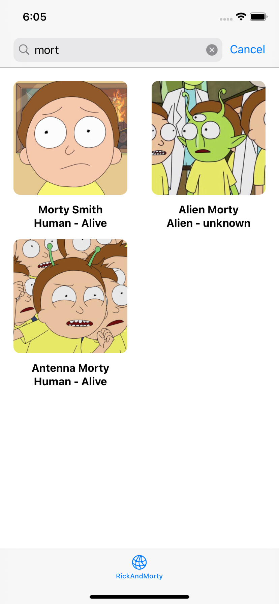
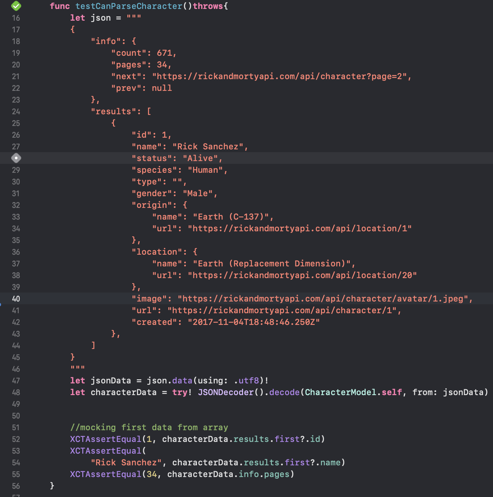
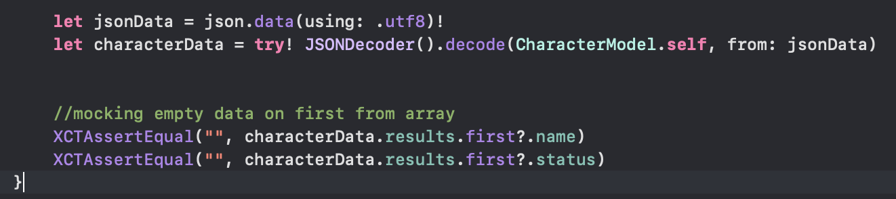
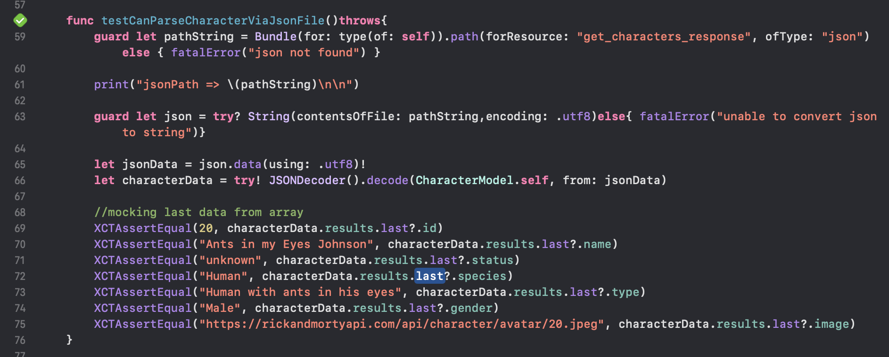
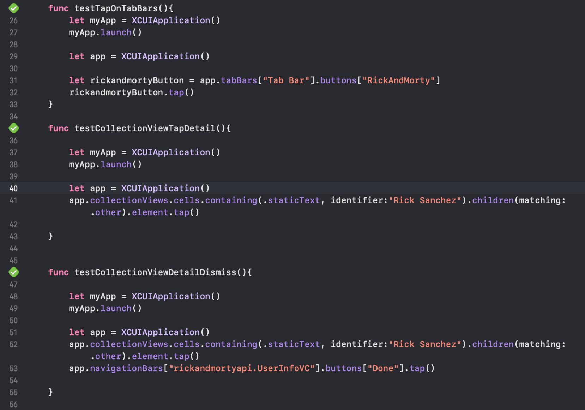

# rickandmortyapi

 
oke, so i delete storyboard and refactor it using programactically ui, because i realized that i learn so much if im using this than storyboard also the auto layout constraint more easy and the view can be reuse using this method,

> i changed table view into collection view and make crossaxis count into 2 idk it looks clean and not wasted some space on the right padding, and for datasource im using UICollectionViewDiffableDataSource, and make CharacterModel Hashable so i can cache the image and not always fetch the new one

 

 

> i also add search and how the search works is i make new variable named "filterCharacter" array to store search result and use .filter to filter whole CharacterModel("characters") and replaced the main array with filter array, if you pressed cancel it gonna swap the array back into main array

 

 
oke and then in detail screen im using model sheet, and i added done button on the top for better userexperience?, and created couple of custom UIView and addsubview using for loop because there's so many UIVIew and Uilabel that need to be constraints,
 

 

 
ok so the first unit test that im testing is jsonParsing i add some jsonString in test and try to encode it using .utf8 then check the value using XCTAssertEqual() to mock the correct model

 
 

 
for second unit test im testing the same method but rightnow im testing if the value is empty

 
 

 
for third unit test i tried load json from file, and test the last character on the array result

 
 

 
last test im testing UI TEST, testing if the collection view can be clicked and can be dismiss using done button
