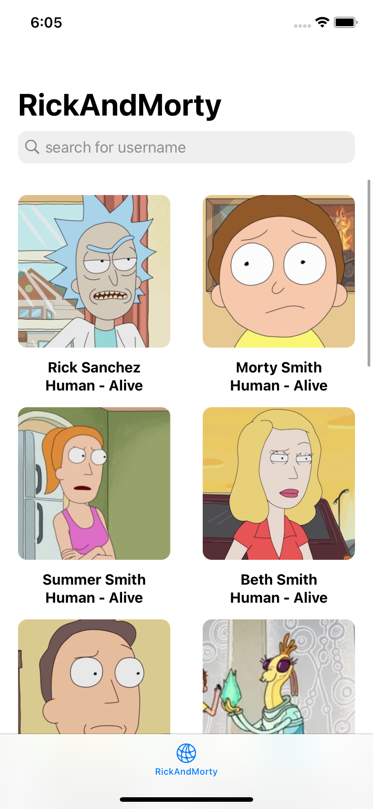
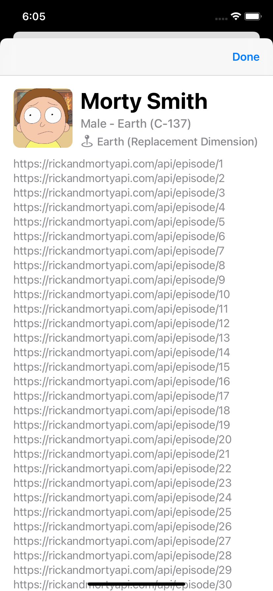

# rickandmortyapi

 
this screen is displaying list with circle image and detail about the characters in each items and in the section of species and status i gave some emoji to differentiated the item :D ...

also in this screen im mainly using storyboard for the view controller and i built the list model with the help of quicktype.io to speedup the process of decoding JSON and parse it in the Character Model

 

 
in this screen i put large image on the top, and passing the data from main controller to a list of table cell, since this viewController not using storyboard i initialized tableview delegate in viewdidload, this screen its supposed to have strech header image but i scratch it 🥲,
 
 
sorry i dont put unit test in this repo
